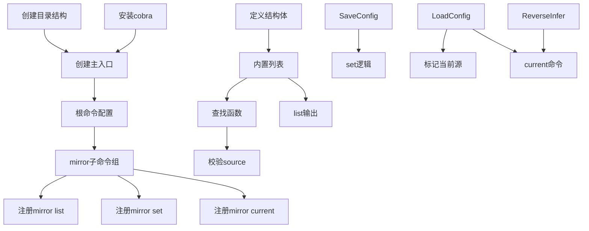

# TODO：P1 项目骨架与镜像管理核心

## 文档关系

- [report.md](report.md)：定义产品方案和实现约束。
- [ROADMAP.md](ROADMAP.md)：定义阶段目标和里程碑。
- [tech-decision.md](tech-decision.md)：定义库选型与自研边界。
- 本文档：定义 P1 的可执行任务和依赖。

> 时间跨度：第 1-3 周 | 状态：进行中

## 优先级说明

| 标记 | 含义 |
|------|------|
| P0 | 阻塞性任务，必须先完成 |
| P1 | 核心功能，必须在本阶段完成 |
| P2 | 增强功能，本阶段内尽量完成 |
| P3 | 锦上添花，如有余力再完成 |

---

## 任务清单

### 1. 项目骨架搭建（P0 · 1-2 天）

- [x] **1.1 初始化 Go 模块** — `go.mod` 已存在，确认 module path 为 `flutter-gradle-tool`
- [ ] **1.2 创建目录结构** — 按报告建立 `cmd/fgt/`、`internal/mirror/`、`internal/gradle/`、`internal/doctor/`、`internal/cache/`
  - 负责人：@dev
  - 预估：0.5h
- [ ] **1.3 安装 CLI 框架依赖** — `go get github.com/spf13/cobra`
  - 负责人：@dev
  - 预估：0.5h
- [ ] **1.4 创建主入口文件** — `cmd/fgt/main.go`，初始化 cobra root command
  - 依赖：1.2、1.3
  - 负责人：@dev
  - 预估：1h
- [ ] **1.5 验证项目可编译** — `go build ./cmd/fgt/...` 通过
  - 依赖：1.4
  - 负责人：@dev
  - 预估：0.5h

### 2. CLI 框架集成（P0 · 1-2 天）

- [ ] **2.1 根命令配置** — 支持 `--version` 和 `--help`，输出工具名称和简介
  - 依赖：1.4
  - 负责人：@dev
  - 预估：1h
- [ ] **2.2 `mirror` 子命令组** — 注册 `mirror` 作为子命令组，`fgt mirror --help` 显示子命令列表
  - 依赖：2.1
  - 负责人：@dev
  - 预估：1h
- [ ] **2.3 占位子命令** — 为 `init`/`cache`/`doctor`/`exec` 注册空占位，输出"功能开发中"提示
  - 依赖：2.1
  - 负责人：@dev
  - 预估：1h
- [ ] **2.4 `version` 子命令** — 输出当前版本号（从编译时注入或硬编码）
  - 依赖：2.1
  - 负责人：@dev
  - 预估：0.5h
- [ ] **2.5 全局标志支持** — `--project-dir` 全局标志，默认当前目录
  - 依赖：2.1
  - 负责人：@dev
  - 预估：0.5h

### 3. 镜像源数据结构（P0 · 1 天）

- [ ] **3.1 定义 MirrorSource 结构体** — `internal/mirror/source.go`，含 Name/DisplayName/GradleURL/MavenURL
  - 负责人：@dev
  - 预估：0.5h
- [ ] **3.2 定义 BuiltinSources 内置列表** — 初始化 4 个镜像源（official/tencent/aliyun/huaweicloud）
  - 依赖：3.1
  - 负责人：@dev
  - 预估：0.5h
- [ ] **3.3 实现 FindByName 查找函数** — 大小写不敏感匹配，返回 `*MirrorSource`
  - 依赖：3.1
  - 负责人：@dev
  - 预估：0.5h
- [ ] **3.4 实现 GetSourceNames 函数** — 返回所有内置源名称列表
  - 依赖：3.1
  - 负责人：@dev
  - 预估：0.5h
- [ ] **3.5 单元测试 — 数据结构** — 覆盖查找成功/失败/大小写/空字符串
  - 依赖：3.3、3.4
  - 负责人：@dev
  - 预估：1h

### 4. `mirror list` 子命令（P1 · 1 天）

- [ ] **4.1 实现列表输出** — 格式化表格输出所有镜像源，包含序号、名称、Gradle URL、Maven URL
  - 依赖：3.2
  - 负责人：@dev
  - 预估：1.5h
- [ ] **4.2 标记当前选中源** — 从持久化配置读取当前源，在列表中用 `*` 标记
  - 依赖：6.2
  - 负责人：@dev
  - 预估：1h
- [ ] **4.3 注册到 mirror 子命令组** — `fgt mirror list` 绑定
  - 依赖：2.2、4.1
  - 负责人：@dev
  - 预估：0.5h

### 5. `mirror set` 子命令（P1 · 2-3 天）

- [ ] **5.1 定义 set 子命令标志** — `--source`、`--wrapper-only`、`--maven-only`、`--ci`、`--interactive`
  - 负责人：@dev
  - 预估：1h
- [ ] **5.2 校验 `--source` 参数** — 检查是否有效镜像源名称，无效时列出可用源并报错（退出码 4）
  - 依赖：3.3
  - 负责人：@dev
  - 预估：1h
- [ ] **5.3 校验 `--ci` 模式** — 如果启用 `--ci` 但未提供 `--source`，报错退出（退出码 5）
  - 负责人：@dev
  - 预估：0.5h
- [ ] **5.4 基本 set 逻辑** — 将选中的源名称写入 `.fgt-config`
  - 依赖：6.1、5.2
  - 负责人：@dev
  - 预估：1h
- [ ] **5.5 `--wrapper-only` / `--maven-only` 分支** — P1 阶段仅写入持久化配置，实际的 URL 替换功能在 P2 实现
  - 依赖：5.4
  - 负责人：@dev
  - 预估：0.5h
- [ ] **5.6 基本交互式模式** — 先使用标准库实现简单菜单供用户选择（无测速信息，P4 再评估是否引入 promptui）
  - 依赖：5.1
  - 负责人：@dev
  - 预估：1.5h
- [ ] **5.7 注册到 mirror 子命令组** — `fgt mirror set` 绑定
  - 依赖：2.2、5.4
  - 负责人：@dev
  - 预估：0.5h

### 6. 持久化机制（P1 · 1-2 天）

- [ ] **6.1 实现 SaveConfig 函数** — 将当前镜像源名称写入项目根目录 `.fgt-config`（JSON 格式：`{"source":"aliyun"}`）
  - 负责人：@dev
  - 预估：1h
- [ ] **6.2 实现 LoadConfig 函数** — 读取 `.fgt-config`，返回当前源名称；文件不存在返回空字符串
  - 负责人：@dev
  - 预估：1h
- [ ] **6.3 实现 ReverseInferSource 函数** — 读取 `gradle-wrapper.properties` 中 distributionUrl，通过字符串匹配内置源列表反向推断当前源
  - 依赖：3.2
  - 负责人：@dev
  - 预估：2h
- [ ] **6.4 单元测试 — 持久化** — 覆盖保存/读取/文件不存在/反向推断/URL 匹配
  - 依赖：6.1、6.2、6.3
  - 负责人：@dev
  - 预估：1.5h

### 7. `mirror current` 子命令（P1 · 0.5 天）

- [ ] **7.1 实现 current 命令** — 优先读取 `.fgt-config`，若不存在则反向推断，若均无法确定则提示"未配置"
  - 依赖：6.2、6.3
  - 负责人：@dev
  - 预估：1h
- [ ] **7.2 注册到 mirror 子命令组** — `fgt mirror current` 绑定
  - 依赖：2.2、7.1
  - 负责人：@dev
  - 预估：0.5h

### 8. 错误处理体系（P1 · 1 天）

- [ ] **8.1 定义退出码常量** — 在 `internal/errors/exitcode.go` 中定义命名常量（ErrProjectNotFound=1、ErrWrapperParse=2 等）
  - 负责人：@dev
  - 预估：0.5h
- [ ] **8.2 实现统一错误输出** — 封装 `ExitWithError(code int, msg string)` 函数，输出错误信息并退出
  - 负责人：@dev
  - 预估：0.5h
- [ ] **8.3 注册全局 PersistentPreRunE** — 在根命令中校验 `--project-dir` 指向的目录是否存在
  - 依赖：2.5
  - 负责人：@dev
  - 预估：1h

### 9. 阶段验证（P1 · 0.5 天）

- [ ] **9.1 端到端测试** — 手动验证以下场景：
  - `fgt mirror list` 输出 4 个镜像源
  - `fgt mirror set --source aliyun` 写入配置成功
  - `fgt mirror current` 显示 aliyun
  - `fgt mirror list` 标记 aliyun 为当前源
  - `fgt mirror set --source unknown` 报错并列出可用源
  - `fgt mirror set --ci` 报错要求提供 --source
  - `fgt --project-dir /not/exist` 报错目录不存在
- [ ] **9.2 代码审查** — 检查所有代码符合 Go 风格、错误处理一致、无未处理的 error
- [ ] **9.3 阶段评审** — 确认 P1 退出条件全部满足，记录经验教训

---

## 依赖关系图

---

## 工作量汇总

| 模块 | 任务数 | 预估工时 | 依赖 |
|------|--------|----------|------|
| 1. 项目骨架 | 5 | 3h | 无 |
| 2. CLI 框架 | 5 | 4h | 模块 1 |
| 3. 数据结构 | 5 | 3h | 无 |
| 4. mirror list | 3 | 3h | 模块 3 + 6 |
| 5. mirror set | 7 | 6h | 模块 2 + 3 + 6 |
| 6. 持久化 | 4 | 5.5h | 模块 3 |
| 7. mirror current | 2 | 1.5h | 模块 6 |
| 8. 错误处理 | 3 | 2h | 模块 2 |
| 9. 阶段验证 | 3 | 4h | 全部 |
| **合计** | **37** | **~32h** | |

> 按每日有效编码 4h 计算，P1 约需 8 个工作日（2 周），预留 1 周缓冲
